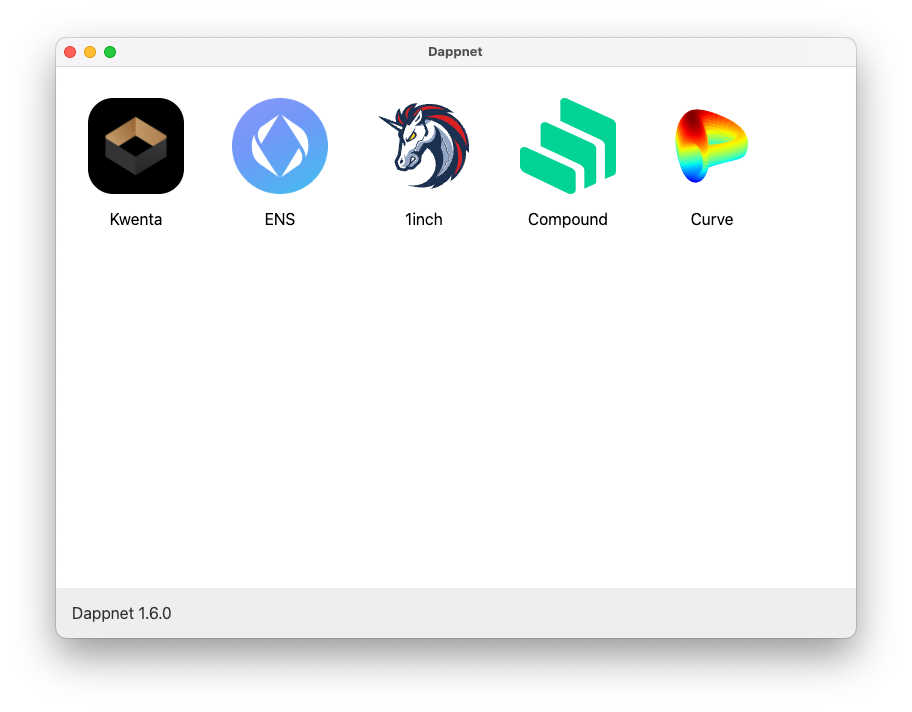

# Install guide.

Welcome to a whole new world ;)

**Compatibility**: macOS with Chrome/Firefox.

### Install the app

1. Download the [package](https://dappnet-update-server-pi.vercel.app/latest/mac/pkg) for macOS.
2. Install.

### Now run it!

Launch "Dappnet", it'll be in your Applications. You should see this

(If not, you can check the logs by running `/Applications/Dappnet.app/Contents/MacOS/Dappnet` in your Terminal. Send them to me.)

Now we need to upgrade your browser to work with Dappnet.

### Using Dappnet with Firefox.

Follow the [instructions here](firefox.md).

### Using Dappnet with Chrome.

Click the link below to install the Dappnet extension.



And that's it!

.eth urls will load in your browser. **They need to end in a slash `/` when you type them in the URL bar, otherwise it goes to Google.**

The **first time** you visit a dapp, it might download a bit slowly (\~10s or so). But after that - the app is downloaded to your device. It loads **instantly**.

How is that possible? What is going on in the background?

Dappnet is running a local IPFS node on your computer, and torrenting directly from a P2P network. You haven't just visited a website, you've downloaded a dapp. It's yours to keep.

